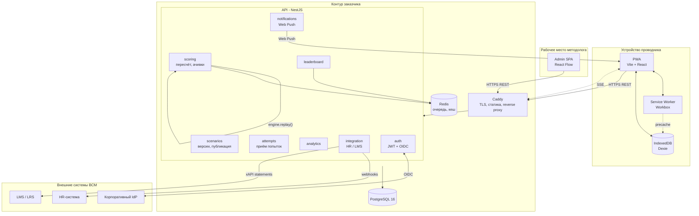
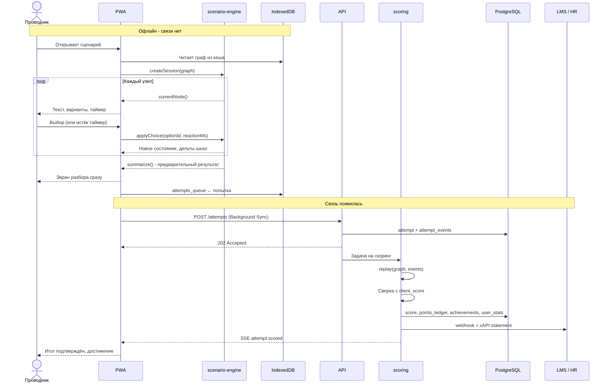

# Архитектура решения

Тренажёр для проводников ВСМ. Документ соответствует пункту 1 требований к сопроводительной
документации из ТЗ («Описание архитектуры решения, диаграмма компонентов / последовательности»).

---

## 1. Образ решения из ТЗ и его реализация

ТЗ задаёт три части. Вот как они реализованы:

| Часть из ТЗ | Реализация | Обоснование |
| --- | --- | --- |
| **Frontend** - веб-интерфейс или мобильное приложение для проводника | **PWA** (Vite + React), устанавливается на домашний экран, работает офлайн | Проводник в поезде: связь нестабильна. Ноль барьера установки, обновление без релизного цикла, один код на iOS и Android |
| **Backend** - движок сценариев, начисление очков компетенций | NestJS: домен + `scenario-engine` + модуль скоринга | Тот же движок, что на клиенте - один TypeScript-пакет |
| **Storage** - сотрудники, сценарии, активность, достижения | PostgreSQL 16 + Redis | jsonb для графов сценариев и правил ачивок, SQL для аналитики |
| **API для интеграции с HR и LMS** | Выделенный интеграционный слой: REST + OpenAPI, webhooks, xAPI, выгрузки, OIDC | В ТЗ выделено отдельным блоком - значит оценивается отдельно |

## 2. Диаграмма компонентов



Ключевой элемент, не видный на схеме: **`packages/scenario-engine`** - чистый TypeScript
без зависимостей, который импортируют и PWA (проигрывание), и модуль `scoring`
(пересчёт по логу решений). Одна логика в двух местах, ноль расхождений.

### Архитектурный стиль

**Модульный монолит на бэкенде, раздельный фронтенд.**

- PWA - самостоятельное приложение, общается с бэком только по HTTP; собирается
  и деплоится отдельно.
- Бэкенд - один процесс NestJS с модулями, у которых жёсткие границы: модуль не читает
  чужие таблицы и не вызывает чужие сервисы в обход публичного интерфейса.
- Одна база, один деплой, никаких сетевых вызовов между модулями.

Модуль `scoring` уже работает через интерфейс `ScoringQueue` и выносится в отдельный
процесс без изменений в домене - это первая точка масштабирования. Микросервисы
для такого масштаба нагрузки были бы избыточны; модульный монолит с выделенными
точками выноса - сознательный выбор, а не компромисс.

### MVP и целевая архитектура

Схема выше - целевая. За время хакатона реализуется её подмножество; остальное -
задокументированные точки расширения с готовыми интерфейсами.

| Компонент | В MVP | Целевая |
| --- | --- | --- |
| Скоринг | синхронно в запросе, `InProcessQueue` | отдельный воркер, BullMQ |
| Кеш и очередь | - | Redis |
| Панель методолога | страница в PWA под ролью, граф как Mermaid | отдельное приложение, визуальный редактор |
| Уведомления | in-app центр, endpoint подписки | Web Push VAPID, расписание по сменам |
| Интеграция | OpenAPI + webhook `attempt.scored` с xAPI-statement в теле | полный набор событий, LRS, импорт оргструктуры |
| Аутентификация | табельный номер + пароль, JWT | OIDC через корпоративный IdP |
| Офлайн | очередь попыток в IndexedDB, кеш сценариев | + предзагрузка медиа по расписанию смен |

---

## 3. Архитектура PWA

### 3.1 Модульная структура

```
apps/pwa/src/
├── app/                    инициализация, роутер, провайдеры, регистрация SW
├── pages/
│   ├── home/               витрина сценариев, прогресс дня
│   ├── player/             прохождение сценария
│   ├── debrief/            разбор после прохождения
│   ├── profile/            профиль, компетенции, достижения
│   ├── leaderboard/        рейтинги
│   └── notifications/      центр уведомлений
├── features/
│   ├── scenario-player/    обёртка над scenario-engine, таймер, шкалы
│   ├── offline-sync/       очередь попыток, Background Sync, разрешение конфликтов
│   ├── achievements/       вручение, анимация
│   ├── feedback/           разбор решений, оценка сценария пользователем
│   ├── push/               подписка, разрешения, входящие уведомления
│   └── analytics/          сбор клиентских событий
├── entities/               scenario, attempt, user, achievement - модели и запросы
└── shared/
    ├── api/                ts-rest клиент из packages/contracts
    ├── db/                 Dexie: схемы таблиц IndexedDB
    ├── ui/                 из packages/ui
    └── lib/                таймер, форматирование, хуки
```

Границы жёсткие: `pages` не знают про `shared/db`, `features` не импортируют друг друга.
Нарушения ловит eslint-плагин на уровне импортов. Это прямой ответ на «модульное
приложение» и «качество кода» из требований.

### 3.2 Проигрыватель сценария

Ядро - `packages/scenario-engine`, чистые функции над состоянием. PWA добавляет только
представление и ввод.

```ts
const [state, setState] = useState(() => createSession(graph));
const node = currentNode(graph, state);

function choose(optionId: string) {
  const reactionMs = performance.now() - shownAt.current;
  setState(s => applyChoice(graph, s, optionId, reactionMs));
}
```

**Таймер.** Отсчёт ведётся по `performance.now()` в `requestAnimationFrame` - плавная
полоса без рассинхрона, который даёт `setInterval`. Дедлайн вычисляется от абсолютной
метки: если приложение ушло в фон, время продолжает идти. Иначе сворачивание окна
превращается в паузу, то есть в чит.

Кольцевой индикатор рисуется на `transform` и `opacity` - без layout-пересчётов,
стабильные 60 fps на среднем Android.

**Шкалы.** Изменение метрики анимируется 400 мс с всплывающей дельтой (`+15`, `−20`).
Это единственная обратная связь о последствии решения в момент выбора - она должна
быть заметной, но не перекрывать текст следующего узла.

### 3.3 Офлайн-модель

Проводник в поезде на 400 км/ч - связь пропадает. Офлайн не режим деградации, а норма.

| Данные | Хранилище | Стратегия |
| --- | --- | --- |
| App shell (JS, CSS, шрифты) | Cache Storage | Precache при установке, обновление по версии билда |
| Графы сценариев | IndexedDB | NetworkFirst, префетч всех доступных при входе в сеть |
| Медиа сценариев | Cache Storage | CacheFirst, лимит 50 МБ, вытеснение по LRU |
| Профиль, достижения | IndexedDB | NetworkFirst с фолбэком на кеш |
| Лидерборд | IndexedDB | NetworkFirst, офлайн показывается с меткой «данные от 14:32» |
| **Завершённые попытки** | IndexedDB | **Очередь на отправку + Background Sync** |

Очередь попыток - самое важное. Прохождение завершается локально, результат
записывается в `attempts_queue` и показывается сразу. Отправка - по событию `online`
и при каждом открытии приложения. Background Sync API сознательно не используется:
он не поддерживается Safari, то есть недоступен на всех iPhone. Собственная очередь
работает везде одинаково. Идемпотентность по `attemptId`, сгенерированному на клиенте:
повторная отправка не создаёт дубль.

Пользователь видит статус синхронизации явно: «3 прохождения ждут отправки». Тихая
потеря результата в офлайн-приложении - худшее, что может случиться с мотивацией.

### 3.4 Уведомления

Web Push через VAPID, self-hosted - без FCM и внешних сервисов.

Честное ограничение: на iOS push работает **только** для PWA, добавленной на домашний
экран (16.4+). Это закладывается в онбординг - установка предлагается на втором заходе,
с объяснением, что она даёт. На Android ограничений нет.

Типы: напоминание о тренировке (по расписанию смен), новый сценарий от методолога,
изменение позиции в рейтинге, полученное достижение. Всё дублируется в in-app центре
уведомлений - push может быть запрещён, контент терять нельзя.

### 3.5 Бюджеты производительности

Нефункциональное требование ТЗ, поэтому - в измеримых числах:

| Метрика | Цель |
| --- | --- |
| JS первого экрана | ≤ 200 КБ gzip |
| TTI, средний Android, 4G | ≤ 2,5 с |
| Старт сценария из кеша (офлайн) | ≤ 300 мс |
| Анимация шкал и таймера | 60 fps, без layout thrashing |
| Lighthouse PWA / Performance | ≥ 90 |
| API p95 | ≤ 200 мс |

Проверяется Lighthouse CI в пайплайне, цифры идут на слайд.

---

## 4. Backend

### 4.1 Модули

| Модуль | Ответственность |
| --- | --- |
| `auth` | JWT access/refresh в httpOnly cookies, argon2; OIDC как опция для корпоративного SSO |
| `users` | Профиль, оргструктура, роли |
| `scenarios` | CRUD, версионирование, публикация, линт графа |
| `attempts` | Приём попыток, идемпотентность, лог решений |
| `scoring` | `replay()` по логу, сверка с клиентским расчётом, начисления, ачивки |
| `leaderboard` | Materialized view + горячий кеш в Redis |
| `analytics` | Агрегаты по узлам, компетенциям, подразделениям |
| `notifications` | Web Push, расписание напоминаний |
| `integration` | HR / LMS - см. раздел 5 |

### 4.2 Скоринг: модуль сейчас, воркер потом

Пересчёт очков, проверка десятка правил достижений и обновление рейтингов - работа,
которой не место в цикле HTTP-запроса. Архитектурно это отдельный воркер.

Реализация: модуль `scoring` с интерфейсом `ScoringQueue`. Две реализации -
`InProcessQueue` (MVP) и `BullMQQueue` (прод). Переключается переменной окружения,
код домена не меняется. На схеме компонент присутствует честно, в разработке
не съедает день на инфраструктуру очереди.

### 4.3 Почему клиент не считает очки

Клиент присылает лог решений `[{nodeId, optionId, reactionMs}]`. Сервер восстанавливает
прохождение тем же движком и считает результат сам. Клиентский расчёт приходит в поле
`client_score` - при расхождении попытка помечается `invalid` и не попадает в рейтинг.

Без этого таблица лидеров накручивается из консоли браузера за минуту, и вся мотивационная
механика обесценивается. Подробности схемы - `data-model.md`.

---

## 5. Интеграционный слой HR и LMS

В ТЗ вынесено отдельным блоком. Четыре канала:

### 5.1 REST API + OpenAPI

Контракт описывается в `packages/contracts` (ts-rest + zod), из него автоматически
генерируется OpenAPI-спецификация и публикуется Swagger UI по `/api/docs`.
Это закрывает пункт 3 требований к документации без ручного написания спеки.

### 5.2 Webhooks

Исходящие события с подписью HMAC и повторными попытками:

| Событие | Потребитель |
| --- | --- |
| `attempt.scored` | LMS - факт прохождения |
| `achievement.unlocked` | HR - геймификационный профиль |
| `competency.threshold.reached` | HR - допуск к смене, основание для аттестации |
| `scenario.published` | LMS - новый учебный материал |

### 5.3 xAPI (Experience API)

Каждое прохождение публикуется как xAPI-statement в LRS:

```json
{
  "actor":  { "account": { "name": "4471", "homePage": "https://vsm.local" } },
  "verb":   { "id": "http://adlnet.gov/expapi/verbs/completed" },
  "object": { "id": "https://vsm.local/scenarios/medical-incident-onboard" },
  "result": { "score": { "raw": 247, "min": 0, "max": 400 }, "success": true,
              "duration": "PT5M42S" }
}
```

xAPI - отраслевой стандарт обмена данными об обучении; корпоративные LMS его понимают.
Это переводит фразу «предоставляем API» из обещания в конкретику, понятную заказчику.

### 5.4 Импорт и SSO

Импорт сотрудников и оргструктуры - CSV или REST, идемпотентно по табельному номеру.
Вход через OIDC - сотрудник пользуется корпоративной учётной записью, отдельных паролей
не заводится.

**Персональные данные.** Ключ пользователя - табельный номер, не ФИО. Вся инфраструктура
self-hosted: Postgres, объектное хранилище и TLS в контуре заказчика, внешних SaaS нет.
Прямой ответ на 152-ФЗ и на п. 9.2 Положения. В демо-данных реальных людей нет.

---

## 6. Диаграмма последовательности: прохождение и начисление



Пользователь видит результат мгновенно и офлайн; канонический приходит позже.
**Обязателен фолбэк:** нет SSE за 5 секунд - оставляем клиентский результат с пометкой
«уточняется». Иначе на питче экран крутит спиннер перед жюри.

---

## 7. Покрытие требований ТЗ

| Требование | Где реализовано |
| --- | --- |
| Управление профилем | `pages/profile`, модуль `users`, компетенции из `points_ledger` |
| Движок сценариев | `packages/scenario-engine`, графы в `scenario_versions.graph` |
| Система таймеров | `TimerSpec` в модели узла, `performance.now()` + rAF, `onTimeout` как полноценная ветка |
| Двойная шкала оценки | `MetricDef[]` - «лояльность пассажира» и «рейтинг безопасности», конфликтующие по замыслу |
| Система достижений | `achievements.rule` - декларативные правила, интерпретирует `scoring` |
| Таблица лидеров | Materialized view + Redis; глобальный и по депо |
| Обратная связь | `FeedbackSpec` у каждого варианта, экран разбора, оценка сценария пользователем |
| Уведомления | Web Push VAPID + in-app центр |
| Аналитика | `attempt_events` по `node_id`, дашборд руководителя в admin |
| Архитектура | Модульный монорепо, изоморфное ядро, раздельный деплой |
| Интеграция | Раздел 5: OpenAPI, webhooks, xAPI, OIDC, импорт |
| Качество кода | TS strict, zod на границах, Vitest на движке, Playwright на прохождении, eslint на границы модулей |
| Развёртывание | `docker compose up` - один файл, инструкция в README |
| Производительность | Бюджеты раздела 3.5, Lighthouse CI |

Таблица идёт в сдаваемые материалы как есть: критерий «соответствие решения задаче»
оценивается по ней напрямую, и упрощать проверку для жюри - в наших интересах.

---

## 8. Развёртывание

```yaml
# infra/docker-compose.yml - состав
caddy       # TLS, статика PWA и admin, reverse proxy на api
api         # NestJS: REST + SSE + scoring in-process
postgres    # 16, том для данных
redis       # кеш лидерборда, очередь при вынесенном воркере
# worker    # профиль production: тот же образ, другая команда запуска
```

Запуск: `cp .env.example .env && docker compose up -d && pnpm db:migrate && pnpm db:seed`.
Всё локально, без внешних сервисов - пункт 2 требований к документации.

Сид: 3 депо, 30 сотрудников с историей за месяц, 3 сценария, 12 достижений, заполненный
рейтинг. Пустой лидерборд на демо читается как недоделанный продукт.

---

## 9. План на оставшееся время

Дедлайн - 27 сентября 23:59 МСК. Два разработчика, два человека на контент,
визуал и презентацию. Около 60 часов.

Принцип - **тонкий срез насквозь, а не слои параллельно**. К вечеру первого дня одно
прохождение работает end-to-end: телефон → сценарий → таймер → шкалы → результат →
API → база → лидерборд. Некрасиво, один сценарий, без офлайна - но живое. Дальше
всё наращивается на работающий каркас, и в любой момент есть что показать.

| | Разработчик 1 | Разработчик 2 | Контент и презентация |
| --- | --- | --- | --- |
| **25.09** | Движок + тесты; экран прохождения с таймером и шкалами на моке | Скелет API, схема БД, `POST /attempts` со скорингом, seed | Сценарий № 1 в JSON; генерация иллюстраций; визуальный стиль |
| **25.09 вечер** | **Срез насквозь: прохождение работает end-to-end** | | Сценарий № 2 |
| **26.09** | Профиль, ачивки, лидерборд, экран разбора; офлайн-очередь | Правила ачивок, лидерборд, аналитика по узлам, webhook + OpenAPI | Сценарий № 3; структура презентации; User Flow |
| **26.09 вечер** | Деплой на VPS в РФ; QR-код открывается с телефона | | |
| **27.09 утро** | Полировка; страница методолога с Mermaid-графом и аналитикой | Багфикс; README с запуском | Презентация |
| **27.09 с 14:00** | **Стоп код.** Демо-видео, документация, репетиция питча | | |

Последняя строка - условие, не рекомендация. Семь материалов по п. 8.7 Положения
плюс четыре по ТЗ не собираются за час. Команды теряют места именно здесь: работающий
продукт, который не успели показать и описать, оценивается как несделанный.

Демо-видео - ещё и страховка: если на площадке 3 октября упадёт Wi-Fi, показ не сорвётся.

Если время поджимает, режем с конца: прохождение → скоринг → профиль и ачивки →
лидерборд → офлайн → страница методолога → интеграция.

## 10. Риски

| Риск | Смягчение |
| --- | --- |
| Не хватает времени на всё | Приоритет: прохождение сценария → скоринг → профиль/ачивки → лидерборд → офлайн → интеграция. Резать с конца |
| Офлайн-слой съедает день | Начинать с online-only, Background Sync добавлять после того, как основной поток работает |
| Пустые экраны на демо | Сид с историей за месяц - делается в первый день, не в последний |
| SSE не доходит на площадке | Фолбэк на клиентский результат за 5 секунд |
| Сценарии выглядят выдуманными | Опираться на регламенты и реальные инциденты; формулировки проверяет тот, кто не писал текст |
| Нет иллюстраций - игра как форма опроса | Визуал начинать в первый день параллельно с кодом |
