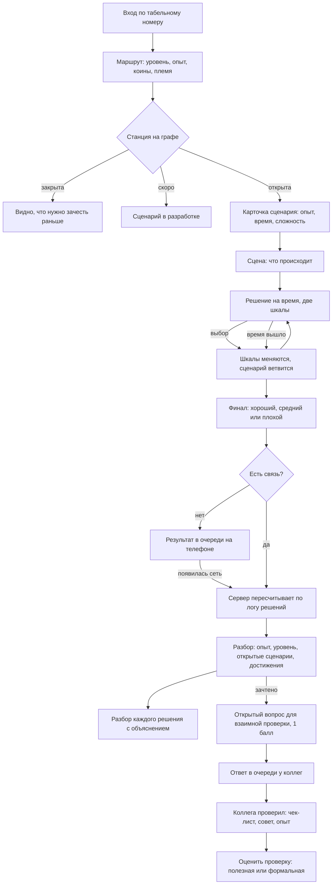
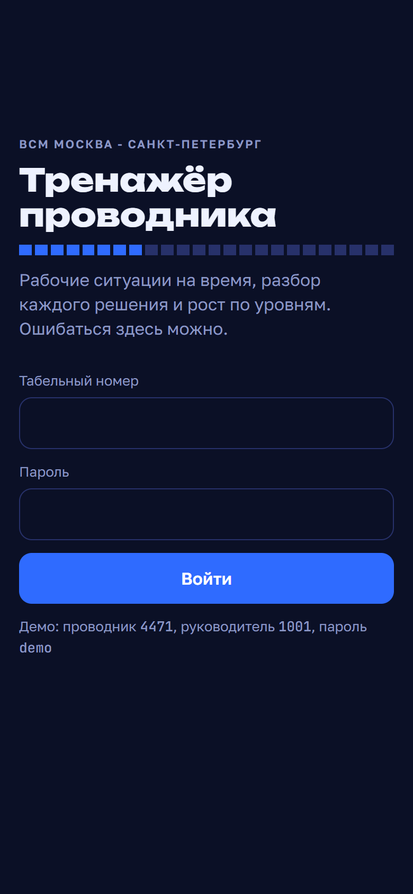
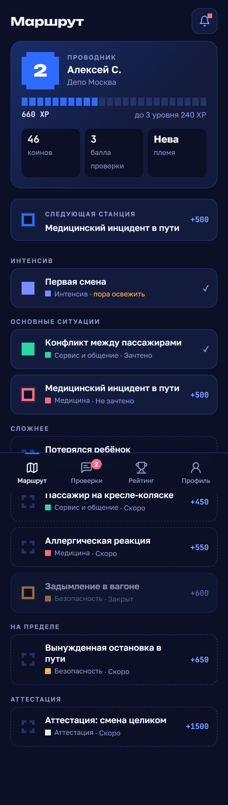
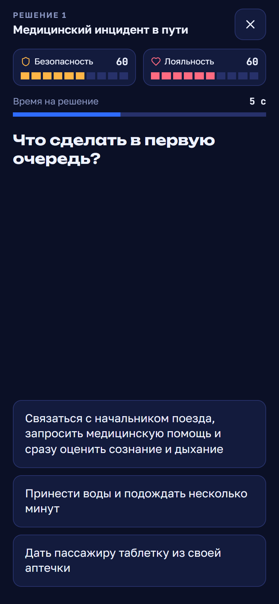
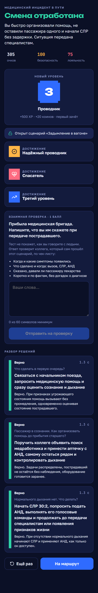
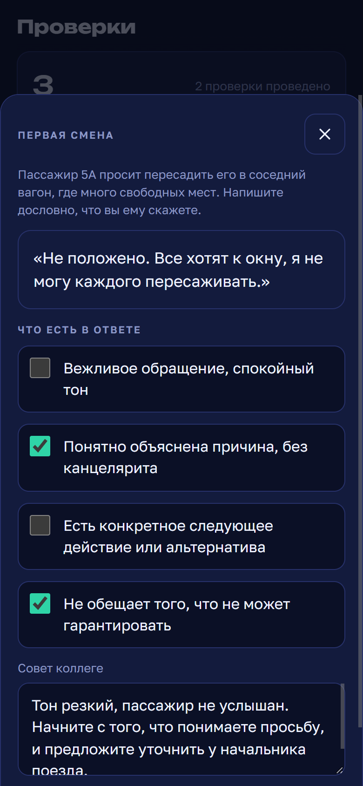
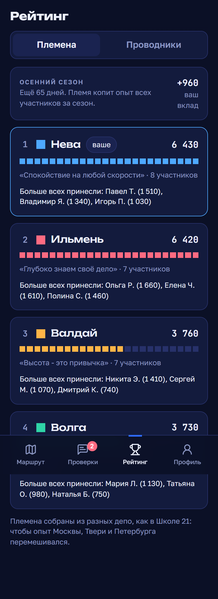
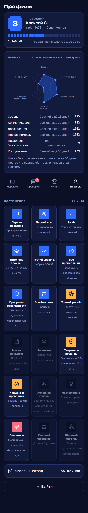
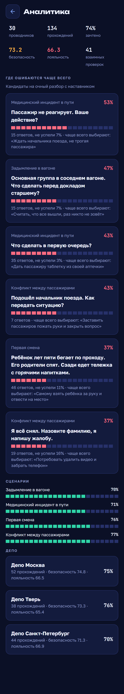

# User Flow

Путь проводника по приложению и путь руководителя. Скриншоты сняты с мобильного экрана
390 px на демо-данных seed. Демо-вход: проводник `4471`, руководитель `1001`, пароль `demo`.

## Проводник: одна смена в тренажёре

### 1. Вход

Табельный номер и пароль. Первый вход нужен с интернетом, дальше приложение
открывается и без сети.

### 2. Маршрут

Главный экран. Сверху - уровень, звание, полоса опыта до следующего уровня, коины,
баллы проверки и племя. Ниже - «Следующая станция» и весь граф сценариев в виде схемы
линии ВСМ. Станции одной ветки соединены линией её цвета:

- залитый квадрат - зачтено;
- пульсирующий - открыт;
- тусклый - закрыт, нужен зачёт предыдущих;
- пунктир - «скоро», сценарий готовит методолог;
- «пора освежить» - прошло больше 30 дней с последнего зачёта.

### 3. Решение на время

Сверху две шкалы: безопасность и лояльность пассажира. Под ними таймер. Когда
выбор меняет шкалы, над ними всплывает изменение (+15, -20). Если время вышло,
это тоже решение: сценарий идёт по ветке промедления. Варианты перемешиваются
при каждом прохождении.

### 4. Разбор

Итог смены, очки и финальные значения шкал. Если результат зачтён впервые -
опыт, коины, при переходе порога - новый уровень, открытые сценарии и новые
достижения. Ниже - открытый вопрос для взаимной проверки и разбор каждого решения:
что выбрали, за сколько секунд, почему это верно или ошибка.

Без сети разбор показывается сразу, а результат уходит на сервер, когда появится связь.
Опыт начисляется после серверного пересчёта.

### 5. Взаимная проверка

Вкладка «Проверки». Сверху - баллы проверки и правило: отправить свой ответ стоит
1 балл, заработать его можно, только проверив коллегу. В очереди - ответы по
сценариям, которые вы сами зачли. Автор скрыт, видно уровень и племя.

Проверяющий отмечает выполненные пункты чек-листа и пишет совет. Во вкладке
«Мои ответы» - полученные проверки, которые можно оценить.

### 6. Рейтинг

Две вкладки. «Племена» - сезонное соревнование четырёх сквозных команд: очки,
девиз, главные вклады, ваш личный вклад. «Проводники» - рейтинг по опыту с уровнем
и званием.

### 7. Профиль

Уровень и опыт, радар шести навыков со сроком свежести каждого, статистика,
достижения, магазин наград.

## Руководитель и методолог

Вход `1001` / `demo`. В профиле появляется «Аналитика обучения»:

- итоги: сколько проводников, прохождений, доля зачётов, средние шкалы, число проверок;
- шесть самых трудных шагов: доля ошибок и тайм-аутов, самый частый неверный вариант.
  Это готовый список тем для очного разбора;
- доля зачётов по сценариям;
- сводка по депо.

## Путь для демонстрации жюри (3 минуты)

1. Вход `4471`. Показать маршрут: уровень 2, граф-схема линии, «Первая смена» пора освежить.
2. Открыть «Медицинский инцидент в пути» и пройти верно. Показать таймер и шкалы.
3. Разбор: уровень 2 -> 3, открылось «Задымление в вагоне», три достижения.
4. Ответить на открытый вопрос и отправить на проверку.
5. «Проверки»: проверить ответ коллеги по чек-листу.
6. «Рейтинг» -> «Племена»: Нева на втором месте, ваш вклад вырос.
7. Выйти, войти `1001`: аналитика, самый трудный шаг и что на нём выбирают.

Перед показом повторите seed, чтобы демо-сотрудник снова был на 2-м уровне.
